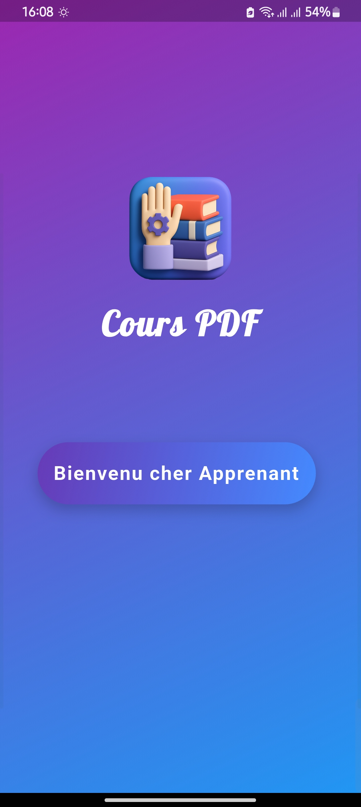
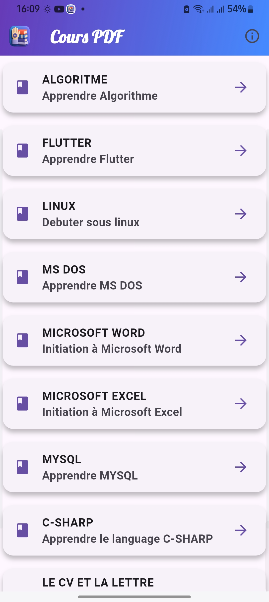
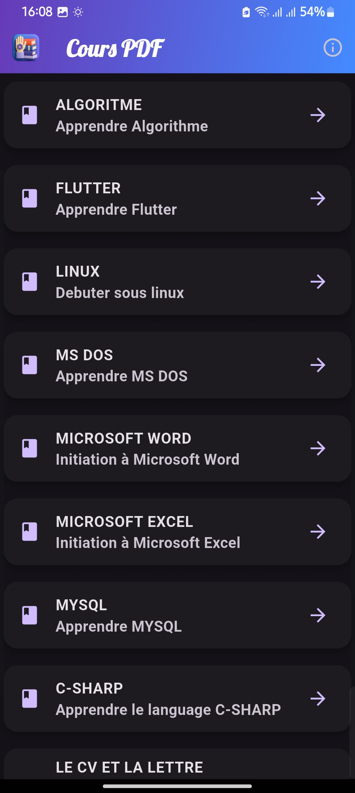
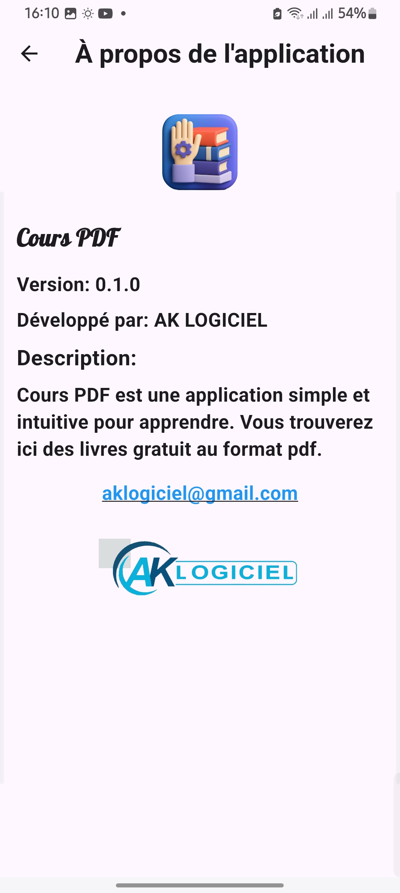
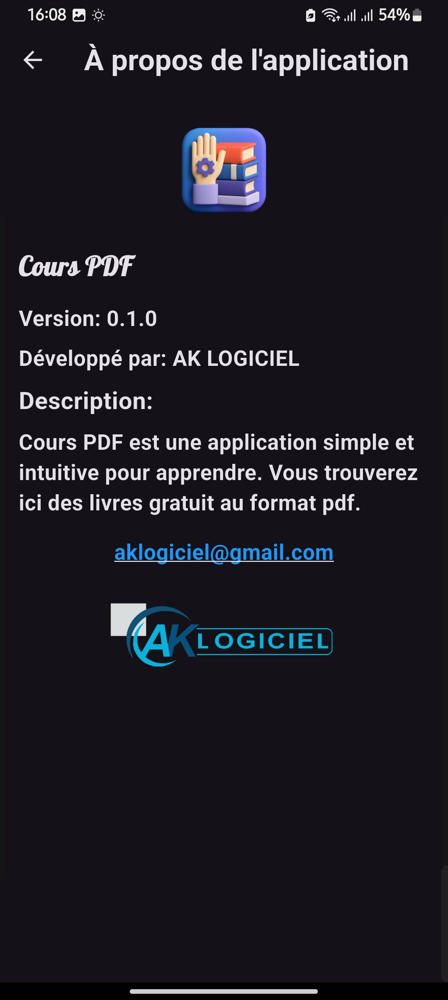
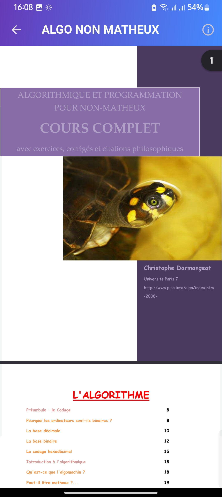

# AK-LOGICIEL

**COURS** **PDF**
----------------------------------------------------

VERSION : 0.1.0  
DATE    : 30-06-2025  
AUTEUR  : AK-LOGICIEL – aklogiciel@gmail.com  
REPO    : https://github.com/aklogiciel/AK-LOGICIEL

DESCRIPTION
-----------------------------------------------------
**COURS** **PDF** est une application des livres gratuits sur:
  - la programmation 
  - le système de gestion de base des données 
  - le CV et lettre de motivation
  - et tant d'autres...   

CAPTURES D’ÉCRAN & ILLUSTRATIONS
-----------------------------------------------------

FONCTIONNALITÉS
------------------------------------------------------ 
• Synchronisation temps réel et mode hors-ligne  
• PDF des qualités  
• Notifications push intelligentes   
• Thème clair / sombre automatique  

PRÉREQUIS
------------------------------------------------------------------------------
• Android 10 ou +  
• ne sera pas adapter à l'écran mais fonctionne aussi avec Android 5,6,7,8,9  
• Windows 7,8,10,11 x64

INSTALLATION
------------------------------------------------------------------------------
• Téléchargez le dépôt :
     https://github.com/aklogiciel/AK-LOGICIEL  
• Dézippez le dossier téléchargé  
• Ouvrez le dossier **Android** et installez le fichier **Cours** **PDF.apk** dans votre telephone Android  
• Ouvrez le dossier **Windows** et installez le fichier **Cours** **PDF.exe** dans votre ordinateur windows  

LICENCE
------------------------------------------------------------------------------
L'application est conçu par le GROUPE AK LOGICIEL Copyright@2025

CONTACT
------------------------------------------------------------------------------
Contactez-nous via Mail: aklogiciel@gmail.com
